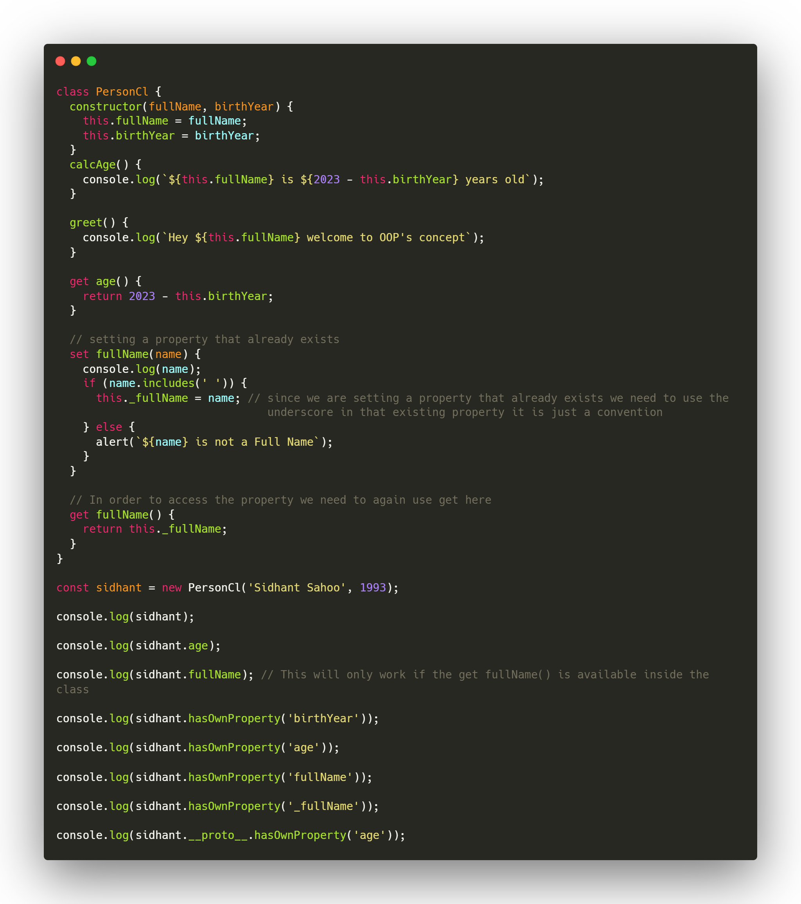
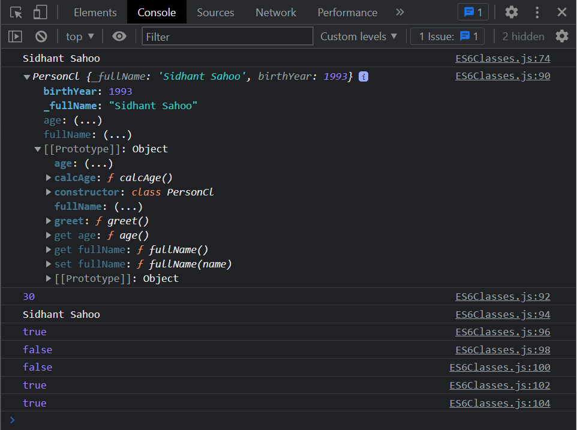

# Object Oriented Programming
## Constructor Function:

```js
Here the comments // are browser console output
```

1. What happens when we call a function with ***new*** keyword?

    When we call a function with ***new*** keyword following thing happens:
    <ul>
        <li>Step 1. New empty object ({ }) is created.</li>
        <li>Step 2. function is called, this points to new empty object created in step 1 i.e. this = { }.</li>
        <li>Step 3. This empty object ({ }) is linked to prototype.</li>
        <li>Step 4. function automatically returns the empty object.</li>
    </ul>
    <br>

    ```js
    const Person = function (firstName, birthYear) {
        console.log(this); // Person {}
    };
    console.log(new Person('Sidhant', 2000)); //Person {}

    $ node app.js
    Person {}
    Person {}
    ```
2. Let's Play with the Constructor function Person

    ```js
    const Person = function (firstName, birthYear) {
        // ......code
    };

    console.log(Person); //f (firstName, birthYear) {}

    $ node app.js
    [Function: Person]
    ```
3. Create objects using the constructor function

    ```js
    const Person = function(firstName, birthYear){
        //Instance Property
        this.firstName = firstName;
        this.birthYear = birthYear;
    };

    // sidhant is instance of Person
    const sidhant = new Person('Sidhant', 1992);

    console.log(sidhant); // Person {firstName: 'Sidhant', birthYear: 1992}

    const jay = 'Jay';

    console.log(sidhant instanceof Person); // true
    console.log(jay instanceof Person); // false

    $ node app.js
    Person { firstName: 'Sidhant', birthYear: 1992 }
    true
    false
    ```
4. Create methods for the Person object:
    ***
     We should not create Object methods like done in the below code because if we create many Person objects using This constructor function, then each of these objects would carry around this function here i.e. so if we have 1000 Person objects then we will have 1000 copies of this function which is terrible for the performance of the code so to solve this problem we will use prototypes and prototype inheritance.
    ```js
    const Person = function(firstName, birthYear){
        this.firstName = firstName;
        this.birthYear = birthYear;

        // Never do this
        this.calcAge = function()  {
            console.log(2022 - this.birthYear);
        }
    };

    const sidhant = new Person('Sidhant', 1992);
    sidhant.calcAge();

    $ node app.js
    30
    ```
    ***

## Prototype:
<hr>

1. What is Prototype explain with examples and create a method to the prototype property to the above constructor function?
    ***
     Each and every functions in the ***JavaScript*** automatically has a property called prototype that includes constructor function, now every objects that is created by certain constructor function will get access to all the methods and properties that we define on the constructor prototype property</br></br>

    ```js
    const Person = function(firstName, birthYear){
        this.firstName = firstName;
        this.birthYear = birthYear;
    };
    const sidhant = new Person('Sidhant', 1992);
    console.log(Person.prototype);

    /*
    browser console
        {constructor: ƒ}
            constructor: ƒ (firstName, birthYear)
            [[Prototype]]: Object
    */

    $ node app.js
    Person {}
    ```
    ```js
    const Person = function(firstName, birthYear){
        this.firstName = firstName;
        this.birthYear = birthYear;
    };
    const sidhant = new Person('Sidhant', 1992);

    console.log(Person.prototype);

    // Now add a method to this prototype property
    Person.prototype.calcAge = function(){
        console.log(2022 - this.birthYear);
    }

    sidhant.calcAge();
    console.log(Person.prototype);
    console.log(sidhant);

    /*
    browser console
        {constructor: ƒ}
            calcAge: ƒ ()
            constructor: ƒ (firstName, birthYear)
            [[Prototype]]: Object

        30

        {calcAge: ƒ, constructor: ƒ}
            calcAge: ƒ ()
            constructor: ƒ (firstName, birthYear)
            [[Prototype]]: Object

        Person {firstName: 'Sidhant', birthYear: 1992}
            birthYear: 1992
            firstName: "Sidhant"
            [[Prototype]]: Object
                calcAge: ƒ ()
                constructor: ƒ (firstName, birthYear)
                [[Prototype]]: Object
    */

    $ node app.js
    Person {}
    30
    Person { calcAge: [Function] }
    Person { firstName: 'Sidhant', birthYear: 1992 }
    ```
    ***

## ES6 Classes:
<hr>

1. Explain ***getters*** and ***setters*** using object literals. </br>

    ```js
    const account = {
        name: 'Sidhant Kumar Sahoo',
        movements: [100, 500, 622, 500],

        get latest() {
            return this.movements.slice(-1).pop();
        },

        set latest(mov) { // Every setter must have one parameter
            return this.movements.push(mov);
        },
    };

    console.log(account.latest); // Here we don't call the method we access it as if it is as property

    account.latest = 50; // Since it is a property not method we can directly set the value like this

    console.log(account.movements);

    /*
    browser console
        500
        (5) [100, 500, 622, 500, 50]
    */

    $ node app.js
    500
    [ 100, 500, 622, 500, 50 ]
    ```
2. Using ES6 Classes implement the above Person constructor in Prototype section with all its property and methods in its prototype

    ```js
    class PersonCl {
        constructor(fullName, birthYear) {
            this.fullName = fullName;
            this.birthYear = birthYear;
        }
        calcAge() {
            console.log(`${this.fullName} is ${2023 - this.birthYear} years old`);
        }
        greet() {
            console.log(`Hey ${this.fullName} welcome to OOP's concept`);
        }
    }

    //The methods also can created by the below prototype code, it  will work as same as the above greet method in class PersonCl

    // PersonCl.prototype.greet = function () {
    //   console.log(`Hey ${this.fullName} welcome to OOPs concept`);
    // };

    const sidhant = new PersonCl('Sidhant Sahoo', 1993);

    sidhant.calcAge();

    sidhant.greet();

    console.log(sidhant.__proto__ === PersonCl.prototype);
    console.log(sidhant.prototype === PersonCl.prototype);

    /*
    browser console
        Sidhant Sahoo is 30 years old
        Hey Sidhant Sahoo welcome to OOPs concept
        true
        false
    */

    $ node app.js
        Sidhant Sahoo is 30 years old
        Hey Sidhant Sahoo welcome to OOPs concept
        true
        false
    ```
2. In ES6 Classes implement getters and setters in the PersonCl class.

    

    ***Output***

    